# Setup

In order to play with the following examples, you need run the commands below:

- download the repository
```bash
git clone https://github.com/Gyumeijie/curl-usage.git
```
- cd into the ```curl-usage/post```, and then run ```npm install```
>Make sure that you have ```node``` and ```npm``` installed in your local computer

- run the ```npm start``` to get server running

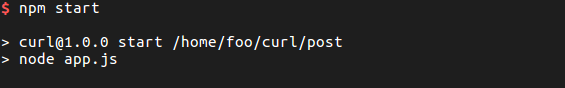
> The server and commands in the following examples should run in different tabs, and you can 
use [tmux](https://github.com/tmux/tmux) to make this easier.


# Examples
## POST application/x-www-form-urlencoded
`application/x-www-form-urlencoded` is the default:

   ```curl -d "author=Gyumeijie&location=China" -X POST http://localhost:3000/data```
   
   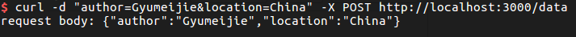
  
explicit:

   ```curl -d "author=Gyumeijie&location=China" -H "Content-Type: application/x-www-form-urlencoded" -X POST http://localhost:3000/data```
   
   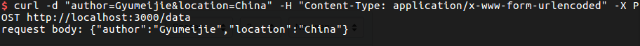
   
with a data file
 
   ```curl -d "@data.txt" -X POST http://localhost:3000/data```
   
   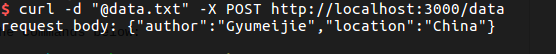
   
## POST application/json

   ```curl -d '{"author":"Gyumeijie", "location":"China"}' -H "Content-Type: application/json" -X POST http://localhost:3000/data```
    
   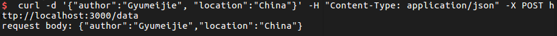
    
with a data file
 
   ```curl -d "@data.json" -H "Content-Type: application/json" -X POST http://localhost:3000/data```
   
   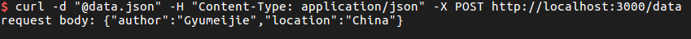
  
## POST multipart/form

1. send file with pure-ascii characters

    ```curl -X PUT -F author=Gyumeijie -F upload="@data.c" -H "Content-Type:multipart/form" http://localhost:3000/data``` 
    
    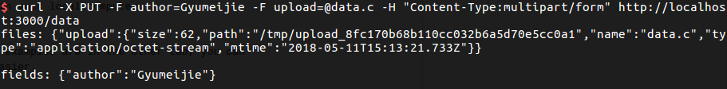
    
    ```curl -d "@data.c" -X POST http://localhost:3000/data```
    
    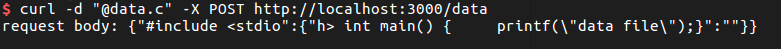
    
2. send file with non-ascii bytes (here we use the binary file from compiling data.c)
    
    Before we send the data, we check what is in the ```data``` file:
    
    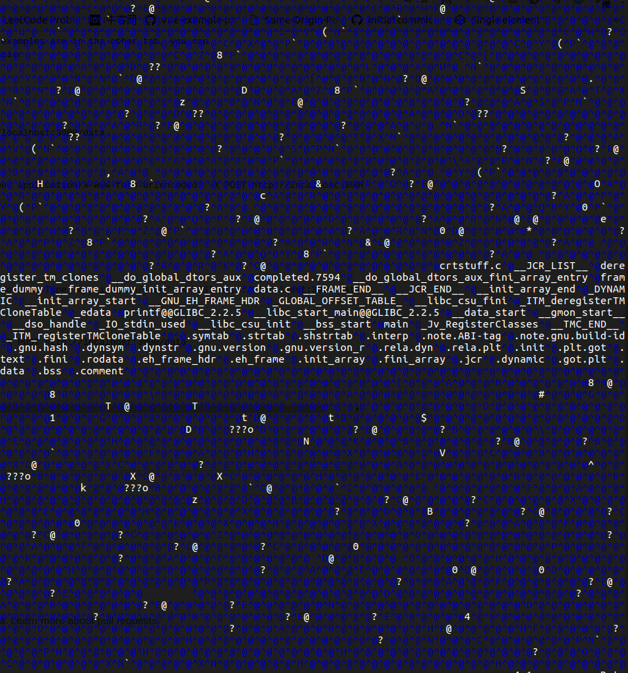
    
    As we can see, the ```data``` file includes many non-ascii bytes. Now let's try sending ```data``` through ```multipart/form```:
    
    ```curl -X PUT -F author=Gyumeijie -F upload=@data -H "Content-Type:multipart/form" http://localhost:3000/data```
    
    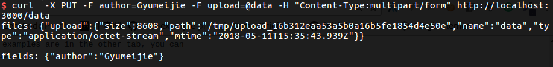
    
    Then let's try sending the ```data``` after it being urlencoded:
    
    ```curl  -X PUT --data-urlencode data@data  http://localhost:3000/data```
    
    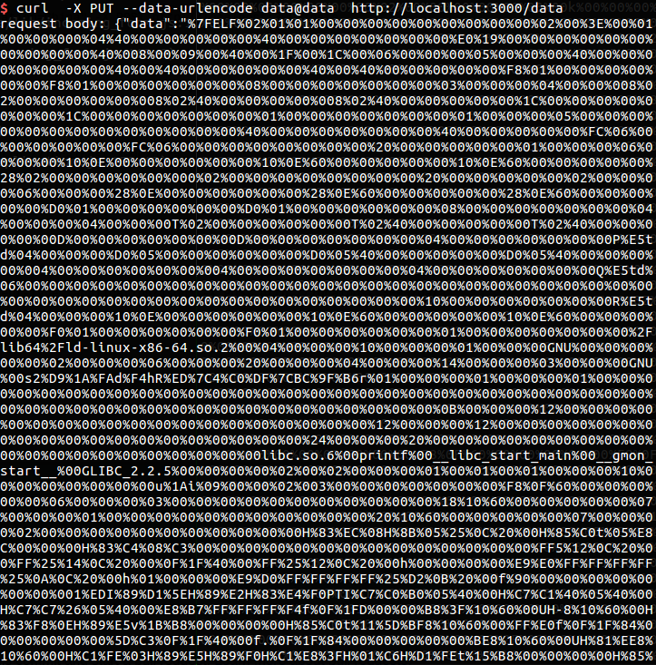
    
    As shown above, the non-ascii bytes in ```data``` file have been encoded in ```%HH``` way, a percent sign 
    and two hexadecimal digits representing the ASCII code of the character, we can count the size by redirect the 
    stdout to ```dump``` file, and then use ```wc -c``` command to count how many bytes it has.
    
    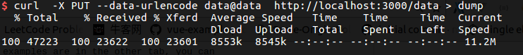
   
    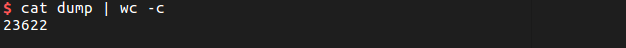
    
# Summary

If you have binary (non-alphanumeric) data (or a significantly sized payload) to transmit, use multipart/form-data. 
Otherwise, use application/x-www-form-urlencoded.

According to the [specification](https://www.w3.org/TR/html401/interact/forms.html) reserved and non-alphanumeric 
characters are replaced by `%HH', a percent sign and two hexadecimal digits representing the ASCII code of the character.

That means that for each non-alphanumeric byte that exists in one of our values, it's going to take three bytes to represent 
it. For large binary files, tripling the payload is going to be highly inefficient. In the above example, we can see that
although the original content from the same ```data``` file, which includes non-alphanumeric bytes, the content transferred through 
```urlencoded``` is much bigger than through the ```multipart/form``` way. 

Why not use multipart/form-data all the time? For short alphanumeric values (like most web forms), the overhead of adding 
all of the MIME headers is going to significantly outweigh any savings from more efficient binary encoding.
